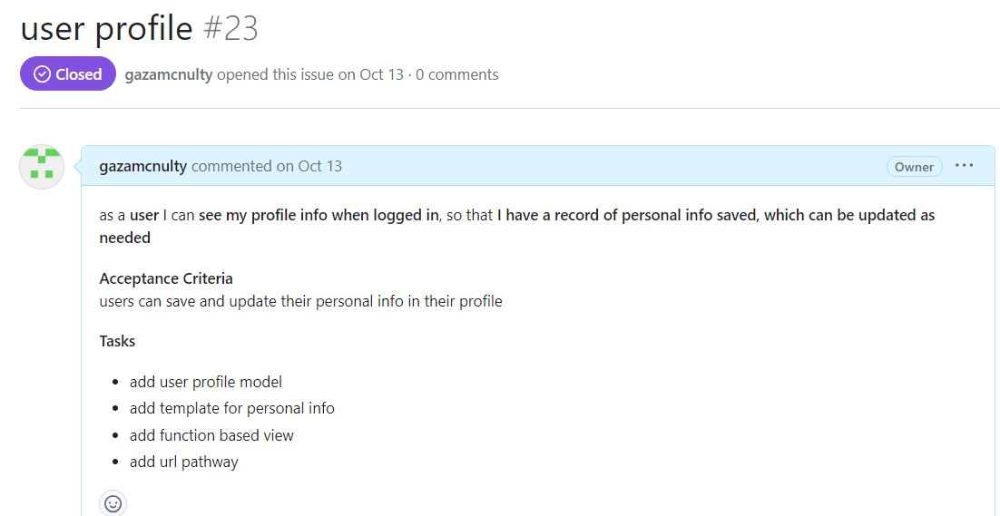
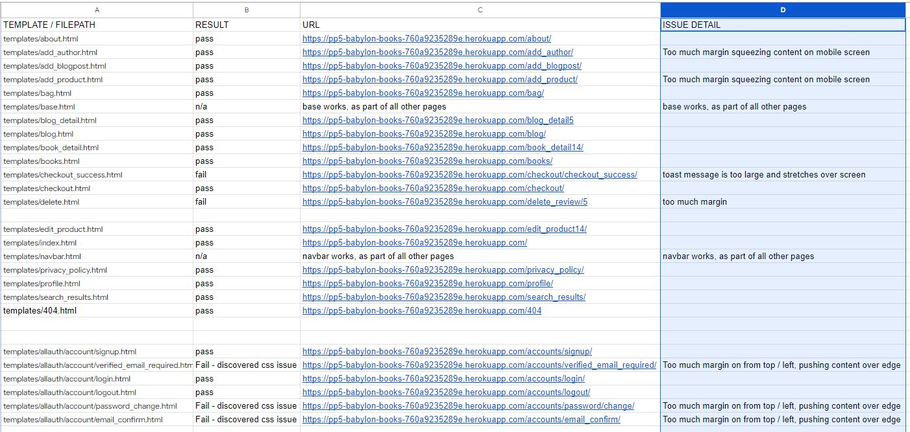
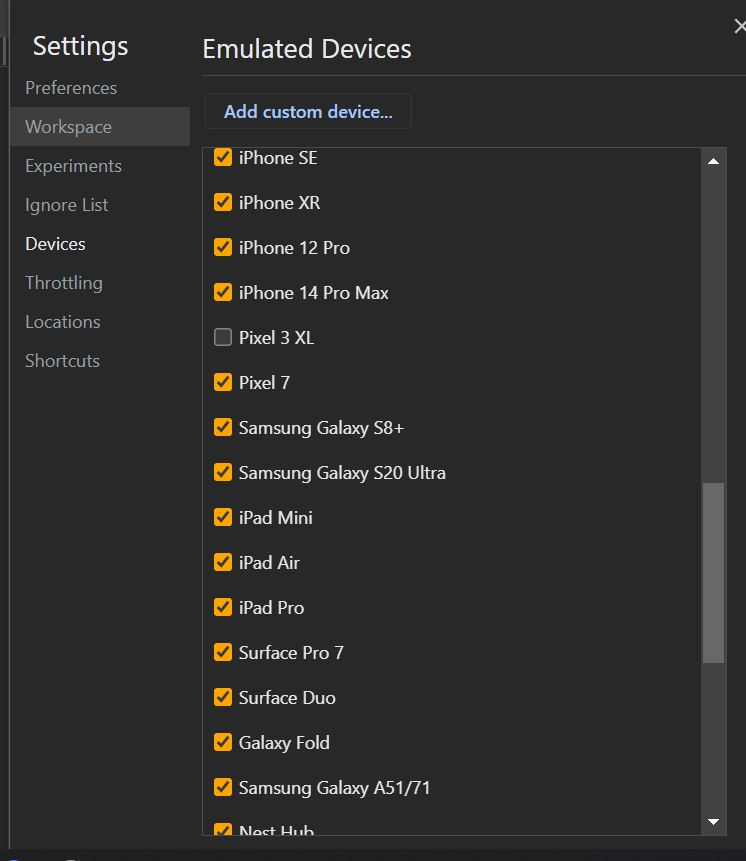
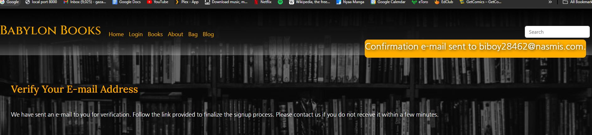
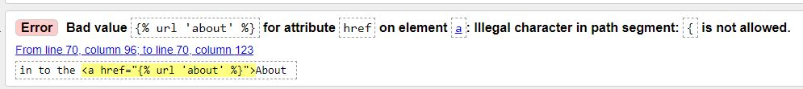
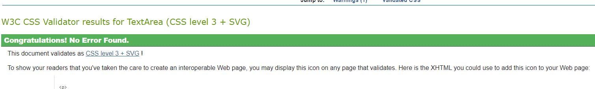

# Babylon Books - Read me

**Link to live site deployed on Heroku**
[Link](https://github.com/gazamcnulty/pp5-babylon-books/tree/main)

**Link to project repository on Github**
[Link](https://pp5-babylon-books-760a9235289e.herokuapp.com/)

- account can be created via standard front facing form on website. if superuser access is required for assesment purposes, please use following credentials
User: admin3
Password: admin3password

- alternatively, create new superuser with manage.py python3 createsuperuser ( you will need con confirm email verified in django )

## About

Babylon Books is a website built to create a new space for book lovers and new readers. It is a store that sells books that are curated and chosen by the founders of the site, they are chosen deliberately based on their likelihood to foster stimulating conversation and debate with the users. The ethos is to spread the love of reading to new readers while providing a space for existing bookworms. It provides a place where users can buy books from a curated selection, view their info and order-history, comment on the book, submit blog posts, like posts. It uses a sleek yet simple design aesthetic to look appealing, welcoming but non-overwhelming. Superusers / admin have access to update the store items in front facing environment, they can create, review, update and delete store items while on the website. Other more specific aspects are available in the django admin backend. Standard users can create profiles, submit payment info via stripe, save their profile info, create comments, blog posts and like posts. These features allow the website to self sustaining without expert assistance.

## Contents

- Introduction
- About
- Contents
- Preparation : Research
- Preparation : Intent
- Preparation: User Stories / Agile methodologies
- Preparation: Marketing / Business
- Features
- Visual Design - colour aesthetic & wireframes
- Validation and testing
- Creation and deployment
- Technologies used
- Known bugs and issues
- Future updates / places to improve
- Sources
- acknowledgements

## Preparation : Research

In preparation for this project, I thought about what kind of site could utilise CRUD functionality for users, but also superusers who are selling a service and require payment via an online facility.  I wanted a website that meets the requirements of the pp5 full stack e-commerce project that could also be used in the real world. The range of websites that would need to request payment is vast, I didn’t want it to be too complex and decided to look at something that would request payment for a static product, without too much variation. This meant moving away from variable services , courses, clothes with different sizes. I decided the most elegant yet simple business would be a noble online bookshop, since a book can be a single entity without variations and books/reading in general is a hobby of mine.

This is also a good idea because while books are not exactly a niche interest, reading books is less popular than it used to be so there is always a desire from smaller communities for dedicated spaces to discuss and buy books that interest them. While smaller communities like this means a smaller user base, I think this makes more sense as it is easier to stand out in a smaller crowd. In this way my site would be competing with dedicated online bookshops, instead of larger stores that sell everything including books. And since I was intending to add on extra features that these dedicated online bookstores don’t provide, its another opportunity for the website to stand out from the others and fill a gap in the market, provided there is a unique selling point.

With this in mind, I conducted research on existing online bookstores, specifically those that are focused mainly on selling books ( excluding stores that sell all kinds of items like Amazon / Argos etc )

- Waterstones 
[Link](https://www.waterstones.com/)

- Blackwells 
[Link](https://blackwells.co.uk/bookshop/home)

- The Works
[Link](https://www.theworks.co.uk/)

- Foyles
[Link](https://www.foyles.co.uk/)

- Wordery
[Link](https://wordery.com/)

After researching these sites, I discovered they had very similar designs, content and features. They all looked mostly bright or white, with very clear legible features, nothing too ambitious in terms of design aesthetic. It seems to be aimed at making the navigation to purchase a book as simple and un-confusing as possible. They don’t look to be aimed at a particular demographic like young people or women , or working professionals - it seems to be blanket approach to try and appear welcoming to everyone. While this is evidently a solid approach that focuses on making the sale of the books as painless as possible, its not quite the approach I want to take. I don’t want Babylon Books to be in and out , quick and painless - I want it to be an interesting , cool site that book lovers want to return to and spend more time on. So I decided to go in a completely different direction with my aesthetic - if Babylon Books is to stand out from its peers I want it to look and feel totally different. Instead of bright friendly colours and aesthetics, it should have a dark, classy look. Insead of looking like a glass of milk sitting on a window sill, it should look like a glass of whiskey sitting on a table in a shadowy reading room. Thats the kind of feel I want to emphasise. 

In terms of the features, the sites all had similar offerings : look at books, at book to shopping bag, proceed to purchase, submit payment via stripe / paypal / etc, receive order confirmation, email, create profile with passwords, reset password, update delivery info, add to wishlist, submit reviews etc. I was aiming to implement most of these already , but I feel that these are all missing the community features that I am looking for. As I said I don’t want it to just be a store where you buy books and you’re done - I want it to be a community of like-minded individuals who like the website because of its cool design, curated booklist, social features and community engagement. With this in mind I decided to implement additional features that were directed at user engagement and community interaction - people should be able to submit comments / reviews of the books in the store, they should be able to submit general blogposts on a separate blog page , they should be able to ‘like’ posts and it should display how many people have liked it. This way its as much about the business end of the store as it is about the space for the book-reading community. The combination of business e-commerce focus, along with social user interactions and content creation will allow my website to stand out.

## Preparation : Intent

Based on above conclusions and conducted research I decided to make a website that offers a cool ‘alternative’ personality and vibe, to the prospective consumer. It offers books for sale, but its not every book under the sun. Its a curated list of only the best most interesting books , which the site runners and users are currently discussion - like a book club. The site runners curate the books on sale, they will look at offering extra benefits to users in future (like podcast / streaming content) while the users who interact with the site also provide content, through book reviews and blog posts. This way its a cool meeting of demographics, everyone has a voice. The design aesthetic will need to go a long way to cultivating the type of personality I want the website to have . I also want the website to be a safespace and feel welcoming to all types of users, so it will be important to have welcoming / encouraging dialogue all over the site, particularly on the homepage and in the about section. This is my chance to communicate directly with potential users and convince them to create an account, make a purchase etc.
In line with the alternative vibe of the site , I also don’t want it too far in the social media direction either. If it had all the bells and whistles of facebook or instagram, it would instantly lose its appeal and overwhelm the users. I want it to be a cool site they can go to, to buy new books , talk about books they are reading, and maybe have meaningful interactions with other users. I don’t want them putting in effort into user profiles or doom scrolling a feed.

## Preparation : User stories / Agile

The ultimate goal of Babylon Books is to provide a unique combination of e-commerce front facing business in the form of an online book shop, with social user interaction/ user generated content. Its not competing directly with online book stores, or social media sites, Babylon Books is trying to carve out a path of its own. With this in mind, I resolved to conduct careful planning both from an agile perspective, but also from business / marketing mindset.

The first step in the agile journey is coming up with a list of user stories : these are hypothetical goals / tasks, that users would want to be able to do when visiting the site. It helps me categorise loose ideas into specific tasks to complete. I made a list of all the features I believed the site ought to have , then considered it from a hypothetical user point of view. This allowed me to create a dynamic list of user stories that would hope to accomplish all of my website goals.
Once I had a list of user stories, I assigned them priority labels from the MOSCOW perspective. This categorises them by must have, should have, could have and wont have . It allows me to prioritise and focus on the most important tasks first, and possibly look at implementing other desirable features later if time permits.
Then , these MOSCOW labelled user stories can be divided up further into iteration projects. These segment the user stories into chunks so they can be tackled together, using a ‘board’ view so that the team can see which has been started, which is currently being worked on , and which has been completed.
Furthermore, a key feature of agile methodology is the inherent flexibility. Although all of the prior features seem essential, its important to remember that agile users are constantly re-assessing the goals, features, user stories, work load as time goes on with the project. This is important because what seems a good idea now, may turn out to be a bad idea later. And, the more work we do on the project, the more experience and info we have to help us determine what should and shouldn’t go into it. With this in mind, i would look at every project iteration while completing the project and see if all of the user stories still made sense as time went on. Sometimes I would change a story to a new goal, or just decide not to complete a user story if it didn’t fit with the overall vision, or if time was an issue. This allows me to focus on the big picture of getting the website completed instead of being bogged down in inflexible tasks.

- Example of a user story from Babylon Books

- projects / iterations for Babylon Books

- Project board

**pp5 Babylon Books issues list** 
[Link](https://github.com/gazamcnulty/pp5-babylon-books/issues?q=is%3Aissue+is%3Aclosed)

**pp5 Babylon Books projects / iterations list**
[Link](https://github.com/gazamcnulty?query=is%3Aclosed&tab=projects)

## Preparation: E-Commerce Business Model + Marketing

As I said in the above section Prep : Research , I looked at a number of successful e-commerce sites that sell books online. This allowed me to see what features they offered, how they marketed the business, what type of goals they appeared to have. This in turn helped me with my own preparation by considering what type of business Babylon Books should be, what types of items / services are being sold, what type of payment we will want and what kind of database tables will facilitate this. All of this also leads into marketing considerations also.

The first thing to consider is what type of E-commerce application would suit Babylon Books. As described above, I am aiming towards individual users rather than large groups / businesses. And the curated books are carefully selected with only a few books on offer at any time, as opposed to having a vast library. As a result, its safe to say that Babylon Books would not be **B2B** (business to business) it would be B2C (business to customer)
This makes more sense as it targets impulse buyers and gives them the freedom to choose for themselves, as opposed to a B2B in which a purchase would be far more considered and laborious.
The slight disadvantage of a B2C business vs B2B is that you would tend to have smaller transactions ( a business is likely to buy a large supply of items, the individual customer will just want one ) . Based on the ethos of Babylon Books it is clear that B2C is the most suitable.

We can also consider what is being sold, to help make business/ marketing and design choices. We are not selling digital items, or a service , we are selling tangible objects : books. So , it is important to have an image of the book cover, information about the author, a search function, price info and maybe a link to wikipedia for more info on the book itself or the author.

The next thing to consider is what type of payment we will want. Although it could make sense in theory, to have a subscription type service that grants exclusive access to community features on the website (like Patreon) its not quite the vibe I want for the website. I think the type of person who will find Babylon Books interesting is not someone who wants to pay a monthly subscription, they are more likely to just buy a book once and be happy with their purchase. Regardless, selling individual items to individual customers means it makes more sense to consider the single payment option. It would be different if we were selling something that required regular replenishment like ink cartridges etc. As we are selling curated books, a once off purchase would be the best choice.

We should also consider what kind of data tables / models would be required in the website, to enable the features that are needed for the desired E-commerce application. We want to sell individual books, to individual users, via stripe. Books have prices, authors, genres. We also want the users to have other features not directly related to the business / E-commerce side, like reviews / blog posts. With this in mind, I know I will need models for Book (fields: title, description, author, genre, price, date_added,) Author  (fields: name, info, external link, image, books_written), Genre(field: name) just for the main books contents. I will also need models for BlogPost and Review, for user CRUD. I can use existing Django models such as User, to help define user profile details. Per the Code Institute tutorials, I will also need Order and OrderLineItem models when designing the checkout . I may need other models than these, but this shows how considering the E-commerce business implications can directly affect the database considerations and how the website will function.

Finally for **marketing** the E-commerce application, I followed the suggested guideline from the Code Institute tutorials and created a **separate facebook business page**. This a page external to the main website thats purpose is to have some extra marketing , advertising and engagement with users away from the main app. Our website can be designed flawlessly, but if prospective customers don’t know about it, its all for nothing. This is where the facebook page comes in. Facebook has a litany of user-friendly business features which we can use to advertise. We can make posts, share images, stream video, pay for direct marketing and advertising to other facebook users. We can select the type of group / demographic who might be interested in our website and use this when making decisions about the facebook advertising. For the purpose of this project, I created a live facebook page for Babylon books , that has a link to the deployed Babylon Books page. In turn, there is a social media link in the footer of Babylon Books that links to the facebook page. So we are increasing the likelihood all the time that we will reach a potential customer with our marketing info, this in turn increases the chance of the E-commerce application succeeding as a real business.

**Screenshots of the Facebook page for Babylon Books**

## Wireframes

* Homepage
 

 * Books
 
 

 * Checkout
 

 * Profile
 

  * Login
 

  * About us
 

## Visual Stucture / Design Features

My intent with the design of Babylon Books, both visually and functionally, is to create a simple yet meaningful layout. I want it to be striking, immediately noticeable, and also immediately easy to understand / intuit. Bootstrap typically favours mobile first design, so I took care to ensure the website was pleasant to use and look at both on small screens and large screens.

* Homepage (index.html)

The overall colour scheme was a response to the online book shops I found when conducting my research. They were mostly bright / white, brightly lit, vanilla. I wanted to go in the complete opposite direction to indicate this site was different from the others, to give it some character. As such, I gave the website a kind of permanent 'dark mode' , it is mostly dark greys, translucent blacks, with occasional colour coming from a contrasting bright orange. The background image is an overflowing library of books , so the semi transparent black colour gives it a pseudo black and white appearance. This goes a long way towards the vibe of the website, the implied black and white aesthetic lends it a kind of artsy elegance ( whether real or imagined ). At the very least, it communicates to the user that this is not your typical bookshop, it has a certain depth to its design. The bright orange is used on large text items like headers or links so they stand out and the user can clearly see them. Most of the text is white , it is a strong contrast on the black background and can clearly be seen. These design choices, along with the darker aesthetic, make it so the website is more pleasant to browse, it does not strain the eyes. It might seem like a small thing but this slightly increases the chance the user will stay on the site for longer, and , make a purchase.

* Landing on the page, the user will see a large horizontal navbar. This is fixed to the top of the page, no matter where the user is or what they are doing . This carries uniform design with the user wherever they go on the site. It also has the site navigation clearly laid out and the current page is highlighted - this improves user experience as the user is less likey to get lost, they can always see where they currently are and can go to another page with one click.

* On the main home page is a call to action ; a welcome banner and a bright orange button entices the user to start browsing our books immediately. This gets the user straight to the e-commerce side, since it is a bookshop it is the first place most users will want to go.

* The next section is signified by a slightly darker background border, that gradually becomes more transparent further down. This does multiple things : it contrasts against the above section, to indicate a new section visually. It matches the footer and navbar, keeping the design consistent. The gradual change to transparency also indicates visually how far down the user has moved and indicates roughly how close they are to the next section. it is also different from the typical strong uniform colours you might see on another website, further communicating the personality / ethos of the site to the user

In terms of spacing and layout, the elements are fairly simple - mostly full screen horizontal. This is important in some sections to as not to overwhelm the user, specifically the homepage should be simple, pleasant and welcoming. However on other busier pages, the content might be split vertically in half to save space on larger screens, then taking up full space when on mobile screen.

* If the user doesn't immediately go to browsing books , they are invited to read more info on the about page or go to the blogs page.
There is a mailchimp input for the user to sign up for a newsletter

* Below this is a brief taste of some recently added books. not the full list, but hopefully just enough to entice the user to browse more and buy some books. If they scroll down past this, they will see another call to action button inviting them to go the books page

* Books page + blog page are similar to the homepage, horizontal layout with books divided by chunks

* About page uses similar simple horizontal layout but this one does opt for the strong contrasting colour background. I felt it was more appropriate since it is the 'wordiest' section

* profile.html

Further Screenshots of various pages on the website

* Books.html

* Book_detail.html

* Checkout.html

* Bag.html

* add_product.html

## Front facing E-commerce
The site can be run in its entirety from the front end by super user / admin. Djano access can be used for extra access like database manipulation.
For superusers to update store info
- They can use 'add author' or 'add book' from the navbar, to add new book new item. ( note , if they want to add new book with new author, please create and save author first. then when creating new book, the author will be 
an option in the list of authors for the new book)
- They can edit existing books , in that books book_detail page. This allows them to edit book info, change linked author or delete the book entirely
- All users have the same access to the stripe payments to purchase a book. Account is not required, but it is recommended. Users can only see thier own profile info
- Users can delete reviews on books, but only their own

## Tests : User Stories / Issues

ASSESMENT : Pass
- The website is online, clearly linked with djagno admin, databases are hosted through Postgres, Elephant SQL

ASSESMENT : Pass
- Navbar is live, navlinks to otherpages are clickable and bring user to other page

ASSESMENT : Pass
- Index.html is the landing page, homepage is visible and laid out properly with welcome text

ASSESMENT : Pass
- As superuser I can login to front end and django admin, update / delete database info

ASSESMENT : Pass
- It is possible to click a button that says login which is clearly displayed in navbar , enables user to sign up and register if not already . Registration works in front end

ASSESMENT : Pass
- It is possible to click a button that says login which is clearly displayed in navbar ,  they can use username and password to login

ASSESMENT : Fail 

This changed during development per agile processes : I decided to remove the login/logout button if the user is logged in and replace it with ‘Profile’ button. The sign out function is available from there , but this userstory would technically be considered a fail since the logout button is not always displayed 

ASSESMENT : Pass
Product / book posts are clearly displayed and visible to users on site

ASSESMENT: Fail

While it is possible for users to post reviews, they can’t currently edit or delete them. This is a feature I will add in a future iteration

ASSESMENT : Fail

Unfortunately I did not end up implementing a wishlist feature. As the website is highly curated, with limited selection of books available a wishlist might not be a huge priority. If the available list of book titles were to increase, it might make more sense in a future iteration

ASSESMENT : Pass

As above, there is no wishlist so this would be considered a fail

ASSESMENT : Pass

Search bar is clearly displayed and visible to users on site , it works and can find book results

ASSESMENT : Pass

About author chunk is on book_detail, with info, photo and link to wikipedia page

ASSESMENT : Fail

This was a result of agile / changing methodologies during project development. Originally, I intended there to be full separate author pages but I ultimately decided the info was best left as a chunk in the book_detail page, with a separate wikipedia link. As it does not meet the criteria , this would be a fail

ASSESMENT : Pass
There is a separate about page which provides more info about the site and its founders

ASSESMENT : Pass
Bag page works, users can add items to their bag

ASSESMENT : Pass
In bag page , users can delete items from their bag

ASSESMENT : Pass
There is a separate blogpost page where users can post blogs

ASSESMENT : Pass
Users can change their password from a link on the profile page

ASSESMENT : Pass
Specific css colors, backgrounds, spacing has been set to the site has a pleasant appearance and layout

ASSESMENT : Pass
Order history is listed on profile page

ASSESMENT : Pass
Profile page displays personal info, address, previous orders 

ASSESMENT : Pass
There is a welcome banner on homepage, suggesting user start shopping, along with other banners asking them to sign up or view about page, or provide email for subscription

ASSESMENT : Pass
There is a separate about page , it has images, horizontal layout, contrasting colours and is responsive

ASSESMENT : Pass
Footer is visible at all times, has links to external sites, site navigation and contact info

ASSESMENT : Pass
Users can click in and view extra info about the book on a separate book_detail page, including author info

ASSESMENT : Pass
Toast message pops up when a book is added to bag, when user is logged in / out, when password is changed etc

ASSESMENT : Pass
Stripe payment is successful , goes through on stripe system and shows in order history

ASSESMENT : Pass
Checkout page shows items in cart, confirms with user if they want to update before going ahead with purchase 

ASSESMENT : Pass
Superusers can see otherwise invisible managestore navbar links to add book , add author. They can also edit / delete books from the book_detail page 

**Conclusion**

 I have passed the majority of userstory tests. A few are considered fails due to technicality, design choices re-visitied during the agile process. A few I would like to add in future iteration like wishlist and author page.

---

## Tests - Links, website validation
Here I sought to check that all  links/pages all over the site are working properly, not just for the user to reach a new page but also for it to look correct in terms of css and responsiveness. I performed the test on chrome and changed screensize with chrome dev tools to check the responsiveness. 

Results: 
All pages are suitably responsive , work on all screen sizes, all links / urls work properly. However some of the margin on smaller screens in certain pages, caused content to flow over edge of screen, so these were considered a fail.

Most passed, the pages with too much margin have no been fixed so sizing on all pages is appropriate

---

## Tests - Responsiveness
Here I used Chrome dev tools to run through a variety of screen sizes, simulating different sized devices to assess how the website looks and works on different viewports

All devices pass

iPhone SE - 320 x 854
iPhone XR - 414 x 896
iPhone 12 Pro - 390 x 844
Pixel 5 - 393 x 851
Samsung Galaxy S8+ - 360 x 740
Samsung Galaxy S20 Ultra - 412 x 915
iPad Air - 820 x 1180
iPad Mini - 768 x 1024
Surface Pro 7 - 912 x 1368
Surface Duo - 540 x 720
Galaxy Fold - 280 x 653
Samsung Galaxy A51/71 - 412 x 914
Nest Hub - 1024 x 600
Nest Hub Max - 1280 x 800
Pixel 6 - 412 x 892
4K monitor 2560 x 1897
Laptop 1440 x 1004
Tablet 768 x 854
Mobile 425 x 854

---

## Tests - Stripe payment , allauth email verification

To check that stripe payments work along with email confirmations, I will use a temporary email address from tempmail.com , register it on the website and attempt a payment.

Tempmail website provides temporary email biboy28462@nasmis.com

Register on Babylon Books with email biboy28462@nasmis.com , username biboy

Babylon Books attempts to send email verification to biboy28462@nasmis.com to confirm account set up

Email received 

Email signup completed

Add books to bag while signed in with biboy , proceed to checkout to make purchase

Order processed from Babylon Books

Stripe shows payment successful, linked with newly registered email biboy28462@nasmis.com

**Conclusion**

All auth email verification successfully sends real emails to email address provided. Stripe payments are succesful , shows as working both on Babylon Books website and on stripe payments screen

---

## Tests - Browsers

I tried running Babylon Books on different browsers to confirm it runs ok . It was checked on Edge, Chrome, Firefox, Safari - all tests passed, all browsers working ok.

---

## Tests - Devices

I tried running Babylon Books on different computers, devices to confirm it runs properly on each system . It was checked on Macbook Pro, Windows 11 on PC , Windows 10 on laptop, iPhone 10, Samsung Galaxy. All tests passed, Babylon Books works ok on all devices.

---

## Tests -  PageSpeed Insights Lighthouse accessiblity, performance , SEO

PageSpeed Insights in the chrome devtools lighthouse test, it checks each webpage for performance, accessibility, SEO

- Homepage

---

- Login 

---

- Books

---

- About

---

- Blog

---

- Profile

---

- Bag

---

## Tests -  W3C Markup Validation 

W3C Markup Validation Service is used to determine the validity of the html docs. Due to the overlapping languages, python django, embedded javascript, it can result in errors which can be ignored.

I ran the w3c and it found many errors pertaining to django / template language code. These can be ignored as it is a known issue, per the below screenshot.

There were minor issues to correct beyond this, including emtpy / stray tag, elements without closing element or general typos. These have all been correcrted

---

## Tests - W3 CSS Validator

- W3C CSS Validator examines the validity / merit of css style code located in static/css/style.css . It found no significant errors with Babylon Books css

## Tests - CI python linter

- Code Institute used for python linter on .py pages in Babylon Books.  It was run through on .py pages to find small python errors , like unnecessary blank space / missing bracket etc.  No serious errors found.

## Creation and deployment

- Creation
Starting from my github repos page  [Link](https://github.com/gazamcnulty?tab=repositories)  I created this via the standard process from the Code Institute tutorials, from the Code Institute -full-template for GitPod [Link](https://github.com/Code-Institute-Org/gitpod-full-template) GitHub. This was accessed by clicking on 'use this template' , choosing a name , description. After this I clicked create repository. this creates the repo, after which you can just click on the button to open GitPod workspace 

- Deployment 
The standard process to deploy a created github repo with the code institute gitpod template is by going to settings from the repo. Then 'pages' , 'sources' , 'Master Branch' and you can deploy from here. However for the purpose of this project it is deployed externally on Heroku app.
more info here [Link](https://docs.github.com/en/pages/getting-started-with-github-pages/configuring-a-publishing-source-for-your-github-pages-site)

To clone the repo you can copy the url from github directly. Use commnd line on windows of terminal on Mac to move it to local directory, then run "git clone" , paste copied url and press enter.
More info here [Link](https://docs.github.com/en/repositories/creating-and-managing-repositories/cloning-a-repository)

To fork the repo, simply navigate to the top of the github page press fork. choose a new owner, provide git hub username, name the new fork. you then choose whether to copy all default or all branches. click create fork to complete the process
More info here [Link](https://docs.github.com/en/get-started/quickstart/fork-a-repo)

To facilitate an external deployment with heroku this project was set up from the beginning with elephantSQL for database storage/migrations , cloudinary for media storage. When it has been deployed correctly on heroku, you need to turn Debug = 'False' in the settings, then run command python3 manage.py collectstatic to collect static data. Once this is all done, you push to github, then go to heroku, link it with the github repo, set the appropriate config variables and then in the 'deploy' section , hit 'deploy'. This then provides an external link so it can be accessed outside of the local environment, link can be shared for external access.

The code institute documentation provides the full process for external Heroku deployment with cloudinary / elephantSQL are here for reference
More info on deployment with django / heroku
[Link](https://docs.google.com/document/d/1P5CWvS5cYalkQOLeQiijpSViDPogtKM7ZGyqK-yehhQ/edit#heading=h.5s9novsydyp1)

## Technologies used

**Main technologies used in code**

- HTML
- CSS
- PYTHON
- Javascript
- Django
- Bootstrap

**External software / websites for project**

- GitHub
- GitPod
- Code Institute Git Pod template [Link](https://github.com/Code-Institute-Org/gitpod-full-template )
- ElephantSQL
- Cloudinary
- Heroku
- Stripe for payments [Link](https://dashboard.stripe.com/test/dashboard )
- W3C Markup HTML validator
- W3 CSS validator
- Techsini for multi screen mockup [Link](https://techsini.com/multi-mockup/index.php )
- Termsfeed.com to create privacy policy [Link](https://app.termsfeed.com/download/44b56c02-e02a-4887-a833-1ea054d3bf22)
- Code Institute Python Linter [Link](https://pep8ci.herokuapp.com/ )
- Sitemaps.com to create xml file [Link](https://www.xml-sitemaps.com/ )
- Google fonts for fonts  [Link](https://fonts.google.com/ )
- Pexels for images [Pexels](https://www.pexels.com/ )
- Wikipedia for book info, author info, images [Wikipedia](https://www.wikipedia.org/ )

## Known errors / Bugs 

I am not aware of any significant bugs on the site that would require correction. 

The most significant bug I did encounter, was a situation when the Book product item was deleted from the data base, causing a a 400 error on every page of the site. This happened becuase the session / cache would still believe the deleted item should be in the bag , but since it was deleted and non existent in the database it would cause a loop. This is something that can happen when manipulating databases in a browser environment, the fix is to either delete the session in chrome dev tools or simply full clear cache, cookies, history via chrome clear history option.
It does not occur in normal practice , only when a superuser is deleting a data item at the same time it is in the session id, so it can be averted by simply doing during scheduled maintenance hours for the site, when users are not accessing it.

## Future improvements

There are a number of features which I am disappointed I did not get to implement in the project.

- Wishlist
Although its not super appropriate for the type of curated book selection that Babylon Books does, it could still be a cool feature for users to suggest what books they would like to see arrive on the site, it would also be useful data for store owners also.

- Always on display bag
Althoug the bag page is fully functional , it would be nice to have it display the number of items and total price at all times over a bag icon at the top of the page. I will look at this in future iterations.

- More CRUD for standard users
As it stands the Babylon Books project is mainly focused on E-commerce, with CRUD features for superusers to add / remove / edit items from the store. There is also limited CRUD functionality for standard users like books reviews and blogposts. However they cannot edit the reviews or the blogposts. They can delete the reviews, but not the blogposts. It would be possible for them to message admin team to request they delete content if needed but this is not an ideal solution. In future iterations I will fully implement this feature for users.

## Sources 

 **Media sources**
 Photos from pexels and wikipedia. Information on books and authors from wikipedia. 

 [Pexels](https://www.pexels.com/ )
 [Wikipedia](https://www.wikipedia.org/ )

 **Code sources**

For the process of completing this project, I followed along with the Boutique Ado tutorials. This was necessary for the E-commerce parts of the project and related apps. It mainly comprises the content of 

- checkout app , models, views, templates
- profiles app, models, views, templates
- allauth set up
- snippets.js
- manage.py
- includes / toasts

I am aware it is standard process to follow along with the tutorials as part of the project and its to be expected that the CI code would be included in the project , but I wanted to as thorough and comprehensive as possible when listing any and all sources.
[Link](https://github.com/Code-Institute-Solutions/boutique_ado_v1/tree/250e2c2b8e43cccb56b4721cd8a8bd4de6686546 )

I have tried to capture every instance of tutorial being followed along with in my own project and I have listed them all in a separate sources page here [Link](sources.md ) There may be some missing parts, or slight variations due to differing names for variables / models etc - but the vast majority of the new guidance specific to E-commerce / payments was followed closely and utilised in my own project.

I also used parts of my previous project pp4 
[Link]( https://github.com/gazamcnulty/pp4-plant-based-ireland )

I also followed along with full stack code institute django tutorials [Link]( https://github.com/Code-Institute-Solutions/Django3blog/tree/master/11_messages )  and multiple youtube tutorials on django. 
[Link]( https://www.youtube.com/watch?v=PtQiiknWUcI&list=PLi9Mnuz2f6jG9dH-No_utZO72gAOrJZbm&index=5&t=8094s&ab_channel=TraversyMedia )
[Link]( https://github.com/divanov11/StudyBud/ )

Non-allauth login/logout, restricted pages
[Link](  https://www.youtube.com/watch?v=PtQiiknWUcI&list=PLi9Mnuz2f6jG9dH-No_utZO72gAOrJZbm&index=5&t=8094s&ab_channel=TraversyMedia )

Linking to unique database details on per-post basis
[Link]( https://stackoverflow.com/questions/70140385/how-do-i-create-link-for-details-in-each-post )

Django docs on pagination
[Link]( https://docs.djangoproject.com/en/4.2/topics/pagination/ )

## Acknowledgements

Special thanks to my mentor Brian Macharia for advice and providing project examples . W3 web pages and youtube tutorials form channels Traversy Media + Very Academy from while working on this project. Code Institute tutors Rebecca , Oisin, Sean for direct assistance. 